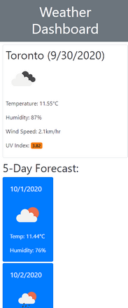
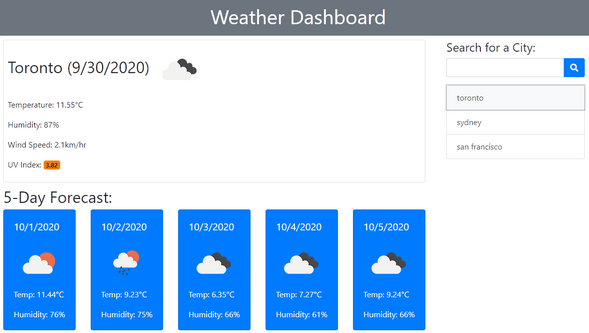

# Weather_Dashboard
This app allows you to query the weather information of various cities. For each city you're interested in, you'll be able to view the current weather conditions as well as conditions for the next 5 days. Weather information is provided courtesy the [OpenWeather API](https://openweathermap.org/api).

The app was made using HTML, CSS, Javascript and Bootstrap, and the layout is responsive to various screen sizes as shown in the screenshots below.

## Usage
The very first time you open the app you'll only see the search box. Enter a city name. For smaller cities with more famous namesakes, append a comma and the country code to your search. For example, to search for London in Ontario, Canada, search for "London,ca". Searching just for "London" will return the weather for London, England. 

Upon a successful search, the current weather, as well as a 5-day forcast will be display. The UV information is colour coded with green for low, and increasing through yellow, orange, red, and fuscia for extreme! 

A list of all your searches will be maintained in a list under the search box. Tapping on any items in the list will cause the weather for that city to be displayed again. 

If you navigate away from the app, when you next return, the app will be pre-loaded with the weather of the last city you searched.

## How It Works
When you search for a city, three API calls are made to OpenWeather API to fetch: 

a. the current weather, 
b. the 5-day forecast, and 
c. the UV information. 

Using javascript, the app extracts portions of the JSON data returned by these API calls and constructs a new 'weather report' object literal which is then stored in localStorage. A list of all searches as well as the last city search is also saved to localStorage. 

In accordance with the OpenWeather API guidelines, if you search for a city a second time (either by using the search box or tapping on the list of previous searches), the weather report will be retrieved from localStorage if less than 10 minutes have passed. If more than 10 minutes have passed, the OpenWeather API will be used to fetch the data again. To make this behaviour possible, the weather reports written to localStorage include a timestamp. So when a weather report is retrieved from localStorage, the app first calculates whether 10 min has elapsed; if no, the weather report is used as is, if yes, new data is fetched to replace the old report.

When the 5-day forecast is fetched, it contains 40 entries of weather reports, every 3 hours, over the course of 5 days. For the 5-day forecast displayed in this app, the mid-day temperatures on each of the 5 days is used;this roughly corresponds to the weather report at 15:00:00 UTC time each day. 

## Try It
You can try the app [here](https://cek333.github.io/Weather_Dashboard/).
